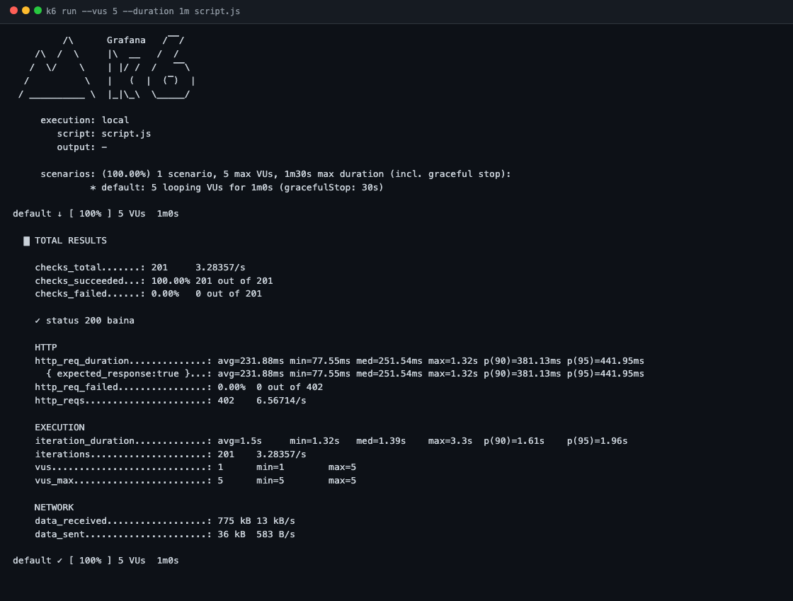
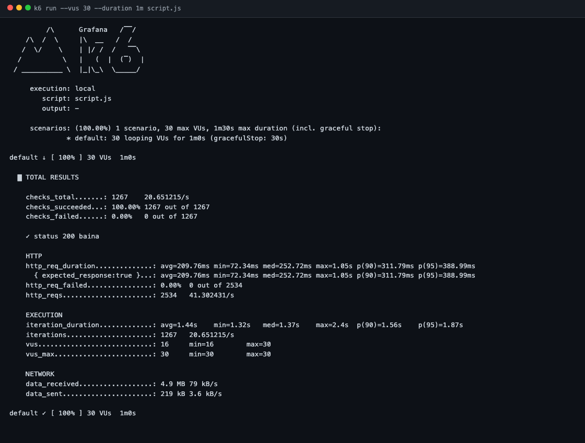
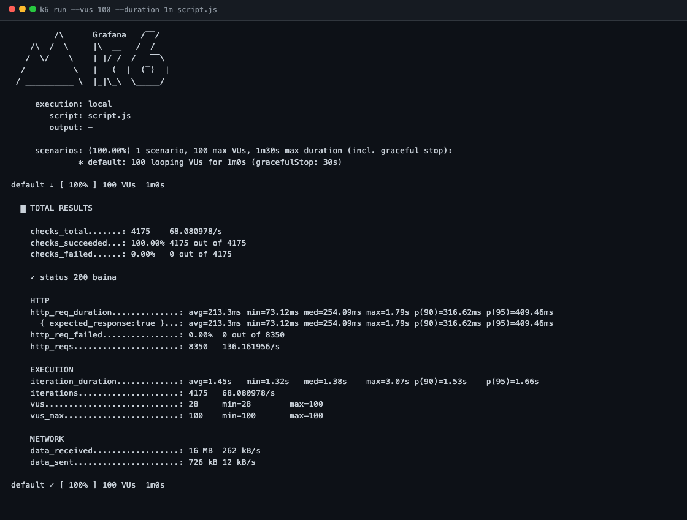
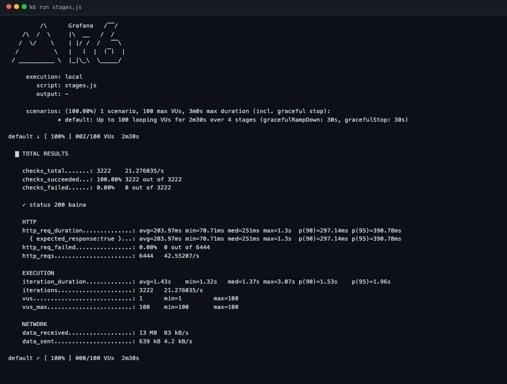
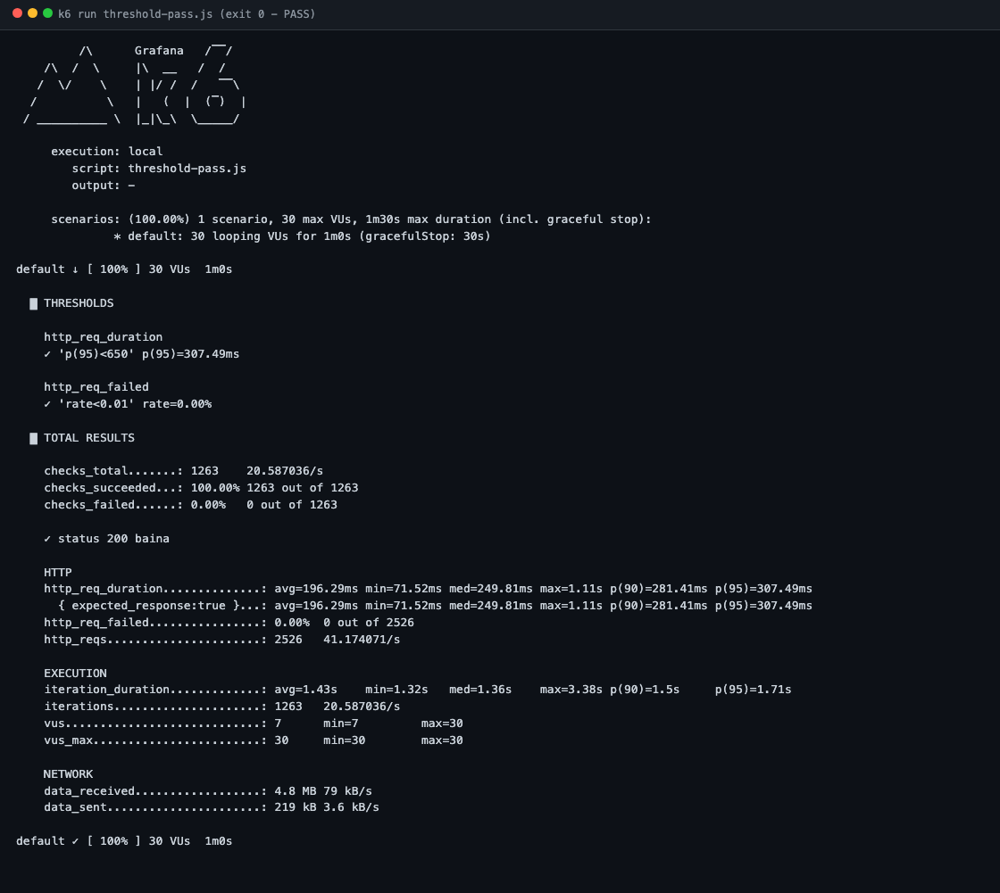
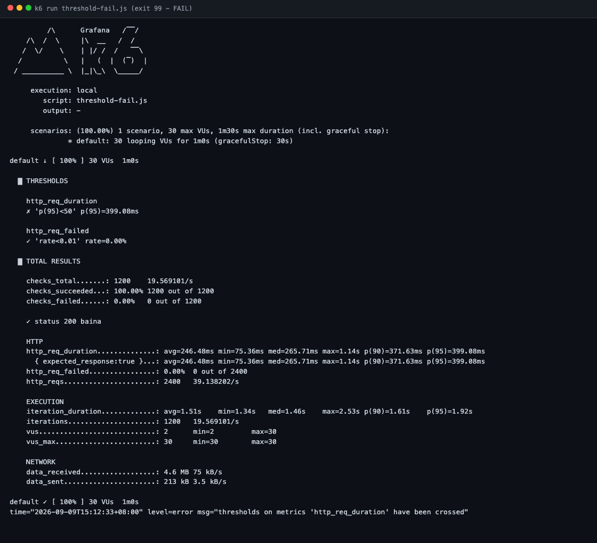
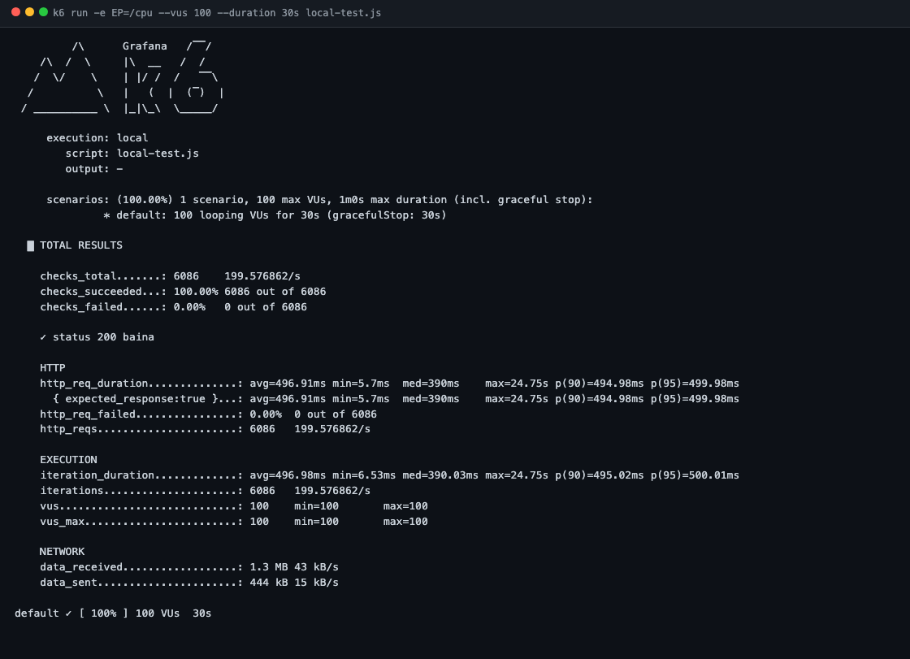
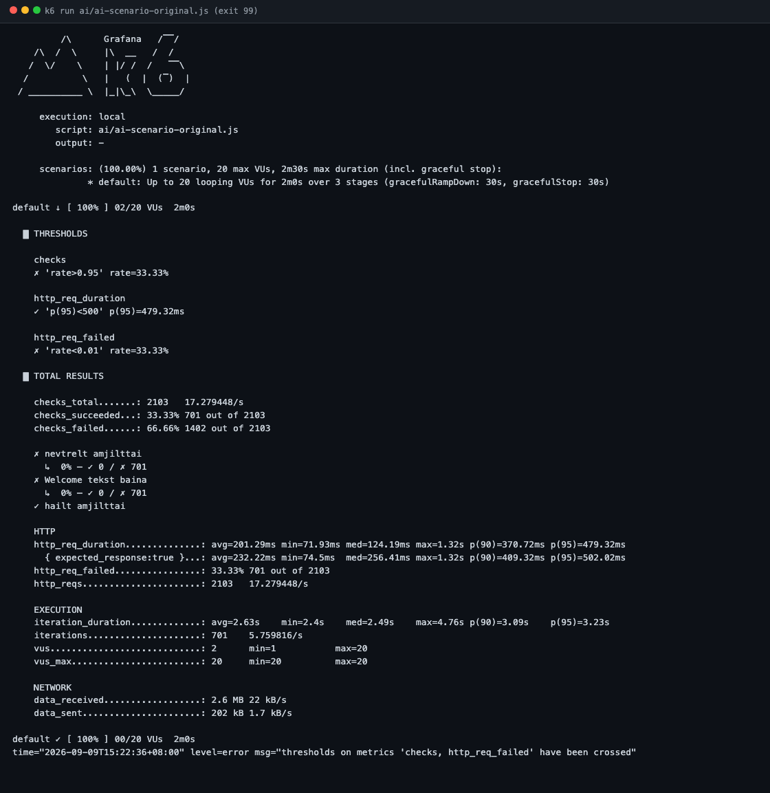
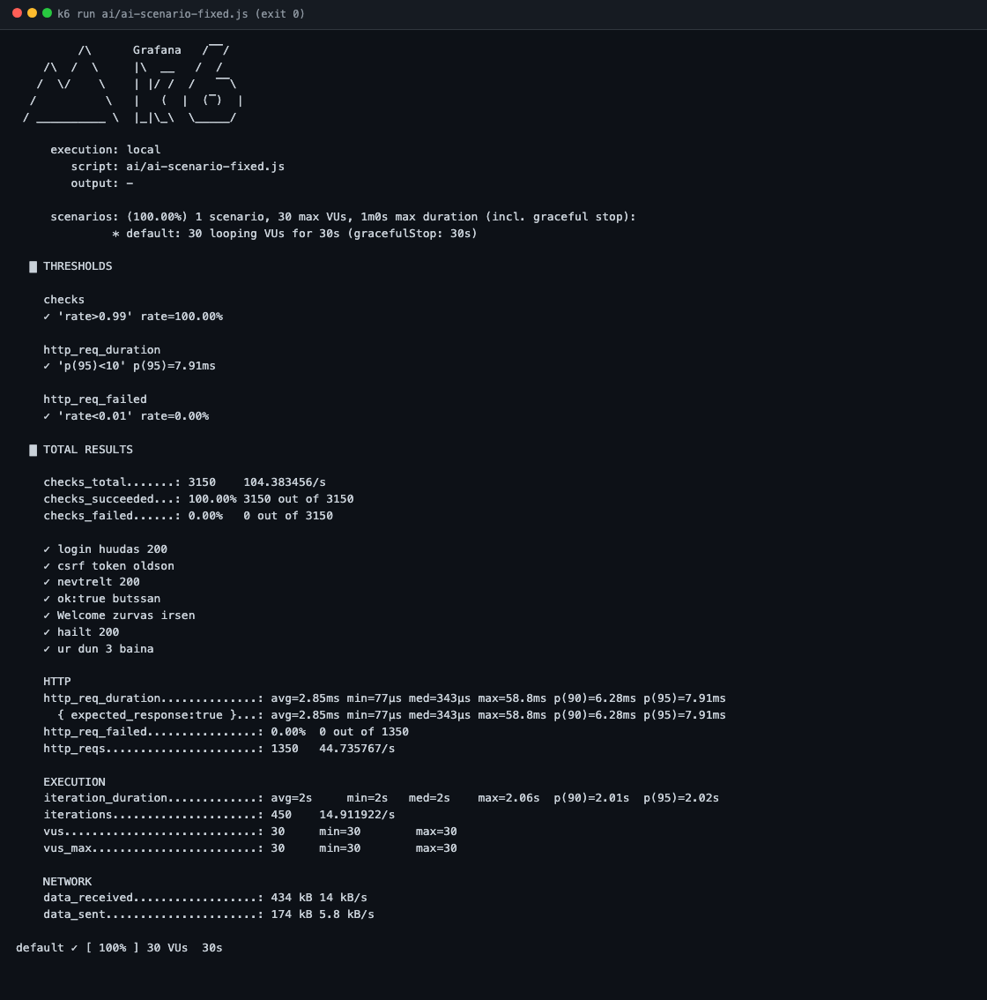

# Лаб 2 — Гүйцэтгэлийн хэмжүүрийг k6-аар хэмжих

F.CSA313 — Программ хангамжийн чанарын баталгаа ба тест (2026)

Оюутан: **Д.Ууганбаяр** · Код: **b232270004**

`test.k6.io` болон өөрийн локал сервер дээр latency (p90/p95), throughput,
error rate-ийг k6-аар хэмжиж, ачаалал өсөхөд гүйцэтгэл хэрхэн өөрчлөгдөхийг
шалгасан ажил.

## Ёс зүйн мэдэгдэл

Бүх тест зөвхөн **зөвшөөрөгдсөн хоёр бай** руу хийгдсэн:

1. `https://test.k6.io` — k6-ийн албан ёсны дадлагын сайт (зааврын Алхам 2-4)
2. `http://127.0.0.1:3000` — өөрийн машин дээрх [`local-server/server.js`](local-server/server.js) (Алхам 5)

Өөр ямар ч сайт руу нэг ч хүсэлт илгээгээгүй. AI-аар үүсгүүлсэн скриптийн
бай хаягийг ажиллуулахаас өмнө шалгасан тухай [AI өнцөг](#ai-өнцөг-нэмэлт-даалгавар)
хэсэгт бичсэн.

## Орчин

```
$ k6 version
k6 v2.0.0 (commit/devel, go1.26.3, darwin/arm64)
```

macOS 26.5.2 (Apple Silicon, arm64), Node.js v22.18.0.

Заавар Ubuntu-д зориулагдсан тул `apt` биш `brew install k6`-аар суулгасан.
Бусад бүх команд өөрчлөлтгүй ажилласан.

## Ажиллуулах

```bash
# Гадаад бай (Алхам 2-4)
k6 run --vus 5   --duration 1m script.js
k6 run --vus 30  --duration 1m script.js
k6 run --vus 100 --duration 1m script.js
k6 run stages.js
k6 run threshold-pass.js     # exit 0
k6 run threshold-fail.js     # exit 99

# Локал сервер (Алхам 5) — эхлээд өөр цонхонд серверээ асаа
node local-server/server.js
k6 run -e EP=/     --vus 100 --duration 30s local-test.js
k6 run -e EP=/slow --vus 100 --duration 30s local-test.js
k6 run -e EP=/cpu  --vus 100 --duration 30s local-test.js
```

Бүх гаралт [`results/`](results/) дотор бүтнээрээ хадгалагдсан. Доорх
хүснэгтүүдийн тоо бүр тэр файлуудаас шууд гарсан.

---

## Алхам 2 — Анхны хэмжилт (baseline)

[`script.js`](script.js), 5 VU × 1 минут, бай `https://test.k6.io`.

Гаралт: [`results/run-05vu.txt`](results/run-05vu.txt)

| Хэмжүүр | Утга | Лекцийн ойлголт |
|---|---|---|
| `http_req_duration` p90 | 381.13 ms | latency |
| `http_req_duration` p95 | **441.95 ms** | latency — энэ бол миний **baseline** |
| `http_reqs` | 402 нийт, **6.56714/s** | throughput |
| `http_req_failed` | **0.00%** (0 / 402) | error rate = POFOD |
| `checks_succeeded` | 100.00% (201 / 201) | — |



**Нэг давталт яагаад 2 хүсэлт үүсгэдэг вэ.** 201 давталт хийхэд 402 HTTP
хүсэлт гарсан. Шалтгааныг шалгахад `test.k6.io` нь одоо
`quickpizza.grafana.com` руу 302-оор дахин чиглүүлдэг болсон байна:

```
$ curl -s -o /dev/null -w "%{http_code} -> %{redirect_url}\n" https://test.k6.io/
302 -> https://quickpizza.grafana.com/
```

k6 нь дахин чиглүүлэлтийг автоматаар дагадаг тул `http.get()` бүр
жинхэнэдээ 2 хүсэлт болдог. Үүнийг мэдэхгүй бол throughput-ыг хоёр дахин
буруу тооцох эрсдэлтэй.

---

## Алхам 3 — Ачааллыг шатлан өсгөх

### Гурван түвшний харьцуулалт

Гурвуулаа **ижил** [`script.js`](script.js)-ээр, 1 минут тус бүр. Зааврын
анхааруулгын дагуу `stages`-ийн нэгтгэсэн summary-г биш, тусад нь
ажиллуулсан гурван гаралтыг ашигласан.

| VU | p90 | p95 | Throughput | Error rate | Гаралтын файл |
|---:|---:|---:|---:|---:|---|
| 5 | 381.13 ms | 441.95 ms | 6.57 req/s | 0.00% | [run-05vu.txt](results/run-05vu.txt) |
| 30 | 311.79 ms | 388.99 ms | 41.30 req/s | 0.00% | [run-30vu.txt](results/run-30vu.txt) |
| 100 | 316.62 ms | 409.46 ms | 136.16 req/s | 0.00% | [run-100vu.txt](results/run-100vu.txt) |




### Хүлээгээгүй үр дүн: latency огт мууджээгүй

Лекцийн "10 хэрэглэгчтэй үед 2с, 100 хэрэглэгчтэй үед 4с" гэсэн зөрчил
**энэ бай дээр гарсангүй**. VU 20 дахин өсөхөд:

- throughput 6.57 → 136.16 req/s буюу **20.7 дахин** өссөн (бараг шугаман)
- p95 442 → 409 ms буюу өөрчлөгдөөгүй, бүр өчүүхэн сайжирсан

5 VU-ийн p95 нь 100 VU-ийнхаас өндөр гарсан нь сэжигтэй байсан тул давтаж
хэмжив: [run-05vu-repeat.txt](results/run-05vu-repeat.txt) → p95 = 416.66 ms.
Өөрөөр хэлбэл 5 VU-ийн жинхэнэ утга 415-445 ms орчим хэлбэлзэж байгаа юм.
Ялгаа нь ачааллаас биш, **дээж багатайгаас** үүдэлтэй: 5 VU дээр ердөө 402
хүсэлт цуглардаг бол 100 VU дээр 8350. Цөөн дээжтэй p95 нь мэдээж чимээ ихтэй.

Шалтгаан нь бай өөрөө: `quickpizza.grafana.com` нь AWS CloudFront CDN-ий ард
байдаг (`13.35.190.8`). CDN нь ирмэгийн серверүүдээрээ 100 зэрэгцээ
хэрэглэгчийг мэдрэхгүй шингээдэг. Өөрөөр хэлбэл **энэ бай дээр миний
100 VU бол ачаалал биш**.

Тиймээс "нэгж хэрэглэгчийн туршлага хаана муудаж эхлэв" гэсэн асуултад
энэ туршилт хариулж чадахгүй нь тодорхой болсон. Хариултыг өөрийн
хяналтад байгаа сервер дээр авах шаардлагатай болсон тул
[Алхам 5](#алхам-5--локал-сервер) руу шилжсэн.

### Stages (ramp-up) ажиллуулалт

[`stages.js`](stages.js) — 5 → 30 → 100 → 0 VU, нийт 2.5 минут.
Гаралт: [`results/run-stages.txt`](results/run-stages.txt)

| Хэмжүүр | Утга |
|---|---|
| p90 / p95 | 297.14 ms / 390.78 ms |
| Throughput | 42.55 req/s |
| Error rate | 0.00% (0 / 6444) |
| VU | min 1, max 100 |



Дээрх ганц summary нь бүх шатны дунджийг нэг тоо болгон нийлүүлдэг тул
гурван түвшний хүснэгтэд **ашиглаж болохгүй**. Энэ ажиллуулалтыг зөвхөн
ачаалал өсөх, буух ерөнхий зургийг харахад хэрэглэсэн.

### Тааралдсан асуудал: 30+ VU дээр бүх хүсэлт унасан

Эхний оролдлогод 30 ба 100 VU дээр **100% хүсэлт унасан**. Гаралтыг
нотолгоо болгон үлдээсэн: [`results/known-issue-dns-30vu.txt`](results/known-issue-dns-30vu.txt)

```
level=warning msg="Request Failed" error="Get \"https://test.k6.io\": dial: i/o timeout"
level=warning msg="Request Failed" error="Get \"https://test.k6.io\": lookup test.k6.io: no such host"
```

Эхэндээ бай сервер биднийг хориглов уу гэж бодсон. Гэтэл `curl` тэр үед
хэвийн 302 буцааж байсан бөгөөд алдааны текст нь `no such host` —
өөрөөр хэлбэл **DNS шийдвэрлэлт** унаж байсан, сервер татгалзсан биш.

Шалтгаан нь k6 давталт бүр дээр шинэ DNS lookup хийхэд macOS-ийн resolver
30-аас дээш зэрэгцээ хүсэлт даахгүй болсонд байв. Засвар нь хаягийг нэг
удаа шийдээд кэшлэх:

```js
dns: { ttl: 'inf', select: 'first', policy: 'preferIPv4' }
```

Үүний дараа 100 VU дээр ч алдаа 0.00% болсон. Энэ бол **хэмжигдэхүүн
буруу гарах эх үүсвэр нь тестлэж буй систем биш, тест ажиллуулж буй машин
байж болно** гэдгийн бодит жишээ. Хэрэв би зүгээр л "100 VU дээр систем
унадаг" гэж дүгнэсэн бол огт байхгүй алдааг мэдээлэх байлаа.

---

## Алхам 4 — Thresholds (SLO-г кодоор шалгуулах)

### SLO-гоо яаж тогтоосон

Зааврын жишээ тоог (`p(95)<300`) хуулаагүй. Өөрийн baseline хэмжилтээс
гаргасан:

| Алхам | Утга |
|---|---|
| Baseline p95 (Алхам 2, 5 VU) | 441.95 ms |
| × 1.5 | 662.9 ms |
| Дугуйлсан SLO | **p(95) < 650 ms** |

**Яагаад 1.5 дахин.** Baseline бол ачаалал багатай, хамгийн сайн нөхцөл.
Ачаалал өсөхөд зарим удаашрал гарахыг хүлээн зөвшөөрөх ёстой, эс тэгвэл
threshold нь SLO биш зүгээр л baseline-ийн хуулбар болно. Нөгөө талаас
хэрэглэгчийн хүлээх хугацаа 1.5 дахин уртсах нь мэдэгдэхүйц муудалт тул
үүнээс цааш явбал тестийг унагах нь зөв. 650 ms гэж бага зэрэг чангаруулж
дугуйлсан.

Алдааны SLO нь `rate<0.01` буюу 1%. Энэ бол лекцийн POFOD (Probability of
Failure on Demand) хэмжүүрийн шууд аналог.

### PASS — [`threshold-pass.js`](threshold-pass.js)

30 VU × 1 минут. Гаралт: [`results/run-threshold-pass.txt`](results/run-threshold-pass.txt)

```
█ THRESHOLDS
  http_req_duration
  ✓ 'p(95)<650' p(95)=307.49ms
  http_req_failed
  ✓ 'rate<0.01' rate=0.00%
```

k6-ийн exit code: **0**



### FAIL — [`threshold-fail.js`](threshold-fail.js)

Яг ижил скрипт, ганц ялгаа нь хязгаарыг 650 ms-ээс **50 ms** болгож
санаатайгаар биелэхгүй болгосон. Гаралт:
[`results/run-threshold-fail.txt`](results/run-threshold-fail.txt)

```
█ THRESHOLDS
  ✗ 'p(95)<50' p(95)=399.08ms
  ✓ 'rate<0.01' rate=0.00%

level=error msg="thresholds on metrics 'http_req_duration' have been crossed"
```

k6-ийн exit code: **99**



50 ms нь хэзээ ч биелэхгүй нь урьдчилан тодорхой байсан — гадаад сайт руу
зөвхөн TLS handshake хийхэд л 70 ms-ээс дээш зарцуулагддаг
(`http_req_duration` min = 75.36 ms).

**CI-д яагаад чухал вэ.** Тестүүд бүгд ✓ болсон ч (`checks_succeeded`
100.00%) k6 нь 99 буцаасан. Өөрөөр хэлбэл функциональ талаараа зөв
ажиллаж байгаа систем **гүйцэтгэлийн шаардлага зөрчсөнөөс болж** CI шатыг
улаан болгож байна. Яг ийм зарчмаар quality gate ажилладаг: 0-ээс өөр
exit code бол pipeline зогсдог.

---

## Алхам 5 — Локал сервер

Алхам 3-т CDN-ий ард байгаа бай дээр ачааллын нөлөө харагдаагүй тул
өөрийн хяналтад байгаа сервер бичсэн:
[`local-server/server.js`](local-server/server.js) — Node-ийн дүрэмс `http`
модулиар, гаднаас нэг ч хамаарал суулгаагүй (`node_modules` огт үүсэхгүй).

| Endpoint | Юу хийдэг | Яагаад |
|---|---|---|
| `GET /` | шууд хариулна | суурийн хэмжилт |
| `GET /slow` | 100 ms `setTimeout` | I/O хүлээлт — event loop-ийг **хаадаггүй** |
| `GET /cpu` | ~5 ms CPU-гийн ажил | event loop-ийг **хаадаг** |

Тест: [`local-test.js`](local-test.js), 30 секунд тус бүр.
Гаралтууд: [`results/local/`](results/local/)

Гадаад тестээс ялгаатай нь энд `sleep()` хэрэглээгүй. Гадаад бай дээр
`sleep(1)` нь бодит хэрэглэгчийн завсарлагыг дуурайх зорилготой байсан бол
энд зорилго нь **серверийн багтаамжийн хязгаарыг олох** тул VU бүр
чадлаараа хүсэлт илгээдэг байх шаардлагатай.

### `/` — шууд хариу

| VU | p90 | p95 | Throughput | Error |
|---:|---:|---:|---:|---:|
| 5 | 144 µs | **180 µs** | 40 811 req/s | 0.00% |
| 30 | 1.35 ms | **1.86 ms** | 34 314 req/s | 0.00% |
| 100 | 2.76 ms | **3.72 ms** | 44 221 req/s | 0.00% |

Энд лекцийн зөрчил тод харагдана. VU 5-аас 100 болоход:

- p95 **20.7 дахин муудсан** (180 µs → 3.72 ms)
- throughput харин огт өсөөгүй (40.8k → 44.2k req/s, хэлбэлзлийн дотор)

Сервер аль хэдийн ханасан байсан тул нэмэгдсэн хэрэглэгчид нэмэлт хүчин
чадал авчраагүй, зөвхөн **дараалалд зогссон**. Систем бүхэлдээ ижил ажил
хийсээр байхад нэгж хэрэглэгчийн туршлага 20 дахин муудсан нь
"throughput сайн байна гэдэг нь хэрэглэгч сэтгэл хангалуун гэсэн үг биш"
гэдгийн яг тэр жишээ.

### `/slow` — 100 ms хүлээлт (event loop чөлөөтэй)

| VU | p90 | p95 | Throughput | Error |
|---:|---:|---:|---:|---:|
| 5 | 102.52 ms | **102.89 ms** | 48.96 req/s | 0.00% |
| 30 | 103.87 ms | **104.38 ms** | 292.61 req/s | 0.00% |
| 100 | 103.77 ms | **104.43 ms** | 975.41 req/s | 0.00% |

Эсрэг зураг: latency бараг **хөдлөөгүй** (102.9 → 104.4 ms), throughput
харин **19.9 дахин** өссөн. Учир нь `setTimeout` нь зүгээр л таймерын
дараалал үүсгэдэг бөгөөд event loop-ийг чөлөөтэй үлдээдэг тул 100 хүсэлт
зэрэг хүлээж чадна.

Энэ хоёр endpoint-ийн ялгаа нь чухал сургамж өгсөн: **удаан хариу
өгдөг бүх зүйл масштаблахад саад биш**. Асуудал нь хүлээх хугацаа өөрөө
биш, нөөцийг эзэмдэж хүлээх эсэх юм.

### `/cpu` — 5 ms CPU (event loop хаагдана)

| VU | p90 | p95 | avg | Throughput | Error |
|---:|---:|---:|---:|---:|---:|
| 5 | 39.97 ms | **40.02 ms** | 25.02 ms | 199.36 req/s | 0.00% |
| 30 | 149.97 ms | **153.98 ms** | 150.01 ms | 199.43 req/s | 0.00% |
| 100 | 494.98 ms | **499.98 ms** | 496.91 ms | 199.58 req/s | 0.00% |



Хамгийн цэвэр үр дүн. Throughput гурван түвшинд **199.36-199.58 req/s** дээр
хөшсөн. Энэ нь санамсаргүй тоо биш: нэг судалтай сервер хүсэлт бүрд 5 ms
зарцуулж байгаа бол онолын дээд хязгаар нь `1000 / 5 = 200 req/s`.
Хэмжилт онолтой 0.2-0.3% зөрүүтэй таарсан.

Латенси харин VU-тай **шугаман** өссөн. Little's Law-гаар шалгавал
(`Latency = VU / Throughput`):

| VU | Онолын дундаж | Хэмжсэн дундаж | Зөрүү |
|---:|---:|---:|---:|
| 5 | 5 / 199.36 = 25.08 ms | 25.02 ms | 0.2% |
| 30 | 30 / 199.43 = 150.43 ms | 150.01 ms | 0.3% |
| 100 | 100 / 199.58 = 501.06 ms | 496.91 ms | 0.8% |

Гурван цэг дээр онол ба хэмжилт 1%-иас бага зөрүүтэй таарсан. Ханасан
системд нэмэлт хэрэглэгч бүр зөвхөн дараалалд зогсох хугацааг л
уртасгадаг болохыг энэ баталж байна.

**Нэгж хэрэглэгчийн туршлага хаана муудаж эхэлсэн бэ.** `/cpu` дээр
throughput 5 VU дээр аль хэдийн 199 req/s дээр ханасан байсан тул
муудалт **5 VU-аас өмнө** эхэлсэн. Онолын хувьд эргэлтийн цэг нь
throughput ханах агшин, өөрөөр хэлбэл 1 VU дээр 200 req/s хүрэх үе юм.

---

## Дүгнэлт

Ачаалал өсөхөд юу болсныг хоёр өөр бай дээр хэмжихэд хоёр өөр зураг
гарсан. `test.k6.io` дээр VU 5-аас 100 болоход throughput 6.57-оос 136.16
req/s хүртэл бараг шугаман өсөхөд p95 нь 442-оос 409 ms болж огт
мууджээгүй; учир нь тэр бай CloudFront CDN-ий ард байдаг тул миний 100
зэрэгцээ хэрэглэгч түүнд ачаалал ч биш байсан юм. Харин өөрийн локал
сервер дээр лекцийн үзсэн зөрчил шууд илэрсэн: `/` endpoint дээр VU 5-аас
100 болоход p95 нь 180 µs-ээс 3.72 ms болж 20.7 дахин муудсан атлаа
throughput 40.8k-аас 44.2k req/s болж бараг огт өсөөгүй. Өөрөөр хэлбэл
систем нэмэлт хэрэглэгчээс нэмэлт ажил гаргаж чадаагүй, тэд зөвхөн
дараалалд зогссон бөгөөд энэ нь "throughput өндөр байгаа нь хэрэглэгч
сэтгэл хангалуун гэсэн үг биш" гэсэн лекцийн гол санааг батлав. `/cpu`
endpoint дээр Little's Law бүр тодорхой батлагдсан: throughput гурван
түвшинд 199.4 req/s дээр хөшиж, латенси нь VU-тай шугаман өсөж, хэмжсэн
дундаж утга онолын `VU / throughput` томьёотой 1%-иас бага зөрүүтэй
таарсан. `/slow` endpoint нь эсрэг талын сургамж өгсөн — 100 ms хүлээдэг
хэдий ч event loop-ийг хаадаггүй тул VU 100 болоход throughput 19.9 дахин
өсөж, латенси нь 102.9-өөс 104.4 ms болж бараг хөдлөөгүй, өөрөөр хэлбэл
удаан байх нь өөрөө масштаблахад саад биш, нөөц эзэмдэх нь л саад болдог
ажээ. Baseline p95 = 441.95 ms дээр үндэслэж тогтоосон `p(95) < 650 ms`
болон `rate < 1%` гэсэн SLO маань 30 VU дээр 307.49 ms гарч **хангагдсан**
(exit code 0), харин хязгаарыг санаатайгаар 50 ms болгоход бүх check ✓
байсаар атал k6 нь exit code 99 буцааж CI-ийн quality gate хэрхэн
ажилладгийг харуулсан. Хамгийн гэнэтийн сургамж нь эхний оролдлогод 30 ба
100 VU дээр бүх хүсэлт унасан явдал байсан: алдааны текст нь `no such
host` байсан тул шалтгаан нь бай сервер биш, миний машины DNS resolver
байсныг илрүүлж, `dns: { ttl: 'inf' }` тохируулснаар зассан. Хэрэв
шалгалгүй "систем 30 VU дээр унадаг" гэж дүгнэсэн бол огт байхгүй алдааг
мэдээлэх байсан тул хэмжилтийн хэрэгсэл өөрөө хэмжилтийг гуйвуулж болно
гэдгийг санах нь чухал байна.

---

## AI өнцөг (нэмэлт даалгавар)

Claude-аар "нэвтрэх, дараа нь хайлт хийдэг хэрэглэгчийн scenario-г k6-аар
бич" гэж скрипт үүсгүүлсэн. Гарсан кодыг **огт засалгүй**
[`ai/ai-scenario-original.js`](ai/ai-scenario-original.js) дотор хадгалсан,
гаралт нь [`results/run-ai-original.txt`](results/run-ai-original.txt).

Ажиллуулахаас өмнө ёс зүйн заалтын дагуу бай хаягийг шалгасан: AI нь
`https://test.k6.io` гэж заасан байсан тул зөвшөөрөгдсөн бай мөн байв,
солих шаардлага гараагүй.

**Шууд ажилласан уу — үгүй.** exit code 99, нэвтрэлтийн check 0% (0 / 701):



Гурван бодит алдаа олдсон:

1. **CSRF token-ыг огт авдаггүй.** AI шууд `http.post()` илгээсэн боловч
   нэвтрэх маягт нь `csrftoken` талбар шаарддаг. Токенгүй POST нь
   CloudFront-оос 403 буцаадаг. Load тестийн үндсэн ур чадвар болох
   *correlation* (өмнөх хариунаас утга сугалж дараагийн хүсэлтэд
   дамжуулах)-ыг AI огт хийгээгүй.
2. **Байхгүй зан төлөвт assertion бичсэн.** AI нь `r.body.includes('Welcome')`
   гэж шалгасан. Гэтэл токен зөв өгсөн ч тэр хуудас 200 буцаагаад дахин
   нэвтрэх маягтаа л үзүүлдэг — `Imitation page` гэж өөрөө бичсэн mock
   бөгөөд session огт үүсгэдэггүй. AI бодит хариуг шалгалгүй, ердийн
   вэб апп ийм байдаг гэсэн таамгаараа бичсэн байна.
3. **Threshold нь baseline-д үндэслээгүй.** `p(95)<500` гэсэн тоо ямар ч
   хэмжилтээс гараагүй. Санамсаргүй тохиолдлоор биелсэн (479.32 ms) нь
   бүр аюултай — ганц удаагийн азаар ногоон гарсан SLO нь хамгаалалт биш.

Мөн `status === 200`-г л шалгасан нь **хуурмаг ногоон** үүсгэж болох
байсан: нэвтрэлт бүтэлгүйтээд маягт буцаж ирэхэд ч статус 200 байдаг.

**Засварласан хувилбар:** [`ai/ai-scenario-fixed.js`](ai/ai-scenario-fixed.js).
Нэвтрэлт бодитоор ажилладаг байхын тулд scenario-г өөрийн локал сервер рүү
шилжүүлж, тэнд `/login` (csrf + session) ба `/search` endpoint нэмсэн.
Скрипт нь одоо маягтаас токен сугалж, хариуны **агуулгыг** шалгаж
(`ok:true`, `Welcome`, `count === 3`), threshold-оо локал baseline
p95 = 6.03 ms × 1.5 = **`p(95) < 10 ms`** гэж гаргасан. Үр дүн: 7 check
бүгд 100%, p95 = 7.91 ms, exit code 0
([results/run-ai-fixed.txt](results/run-ai-fixed.txt)).



**Юу нь дээр, юу нь дутуу байсан бэ.** AI-ийн бүтэц үнэхээр сайн байсан:
`group()`-оор алхмуудыг тусгаарласан, stages-ийг ramp-up/plateau/ramp-down
гэсэн зөв хэлбэрээр өгсөн, `checks` дээр threshold тавьсан нь би өөрөө
анх бодоогүй санаа байлаа. Синтакс дээр нэг ч алдаа гараагүй. Дутуу нь
бүхэлдээ нэг зүйлд буюу **бай системийг шалгаагүйд** байсан: AI нь эх код,
хариу, лог гэсэн бодит нотолгоо харалгүй "ердийн вэб апп ийм байдаг" гэсэн
таамгаараа бичсэн. Тиймээс AI-г араг яс бичүүлэхэд ашиглаж, харин бай руу
нэг хүсэлт илгээж хариуг нь уншсаны дараа assertion болон threshold-оо
өөрөө бичих нь зөв ажлын хуваарилалт болох нь харагдлаа.

---

## Репозиторийн бүтэц

```
lab02-k6/
├── script.js                     Алхам 2-3: үндсэн тест (5/30/100 VU)
├── stages.js                     Алхам 3: ramp-up
├── threshold-pass.js             Алхам 4: SLO биелсэн (exit 0)
├── threshold-fail.js             Алхам 4: SLO зөрчсөн (exit 99)
├── local-test.js                 Алхам 5: локал сервер рүү тест
├── local-server/server.js        Алхам 5: /, /slow, /cpu, /login, /search
├── ai/
│   ├── ai-scenario-original.js   AI гаргасан код, засваргүй
│   └── ai-scenario-fixed.js      өөрөө зассан хувилбар
├── results/                      k6-ийн БҮТЭН текст гаралтууд
│   ├── run-05vu.txt  run-30vu.txt  run-100vu.txt
│   ├── run-05vu-repeat.txt        хэлбэлзэл шалгасан давталт
│   ├── run-stages.txt
│   ├── run-threshold-pass.txt     run-threshold-fail.txt
│   ├── run-ai-original.txt        run-ai-fixed.txt
│   ├── known-issue-dns-30vu.txt   DNS асуудлын нотолгоо
│   └── local/                     fast-/slow-/cpu- × 05/30/100 VU
└── docs/
    ├── screenshots/               9 зураг
    └── make-screenshots.sh        зургийг гаралтаас үүсгэдэг скрипт
```

Дэлгэцийн зургуудыг [`docs/make-screenshots.sh`](docs/make-screenshots.sh)
нь `results/` доторх бодит гаралтын файлуудаас үүсгэдэг. Тиймээс энэ
README-гийн хүснэгтийн тоо, хавсаргасан текст файл, зураг гурвуулаа
нэг эх сурвалжаас гардаг бөгөөд хооронд нь зөрөх боломжгүй.
